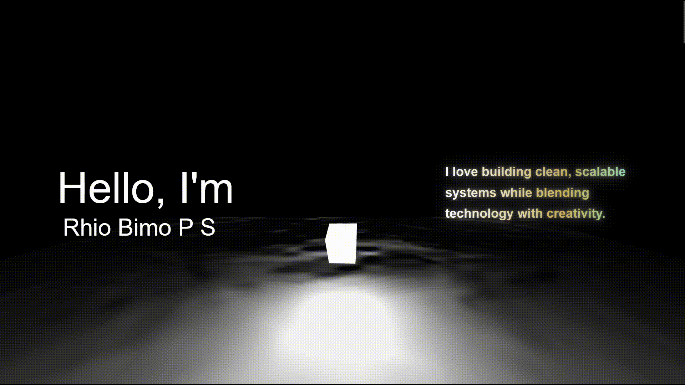

# Portfolio

## Introduction

I built myself a 3D developer portfolio website to replace my minimal portfolio. This website aims to give a sense of what I can do in computer science and the bounds of my creativity. this website is also using three.js 3D graphics, interactive animations, and so much more to maintaining an easy-to-use and intuitive design.

## Tech-Stack
- Vite - Build tool for the boilerplate and structure
- JavaScript - Programming language
- React - JavaScript library for building user interfaces
- Tailwind - CSS framework
- Three.js - Animated 3D graphics
- Framer Motion - Interactive animations
- GitHub - Version control, CI/CD, and Deployment

## Extra Resources & Credits
- [Template by ForrestKnight](https://www.youtube.com/@fknight)
- [Position Animation by Teshank](https://github.com/teshank2137/portfolio)
- [3D Anime Model made with VRoidStudio]